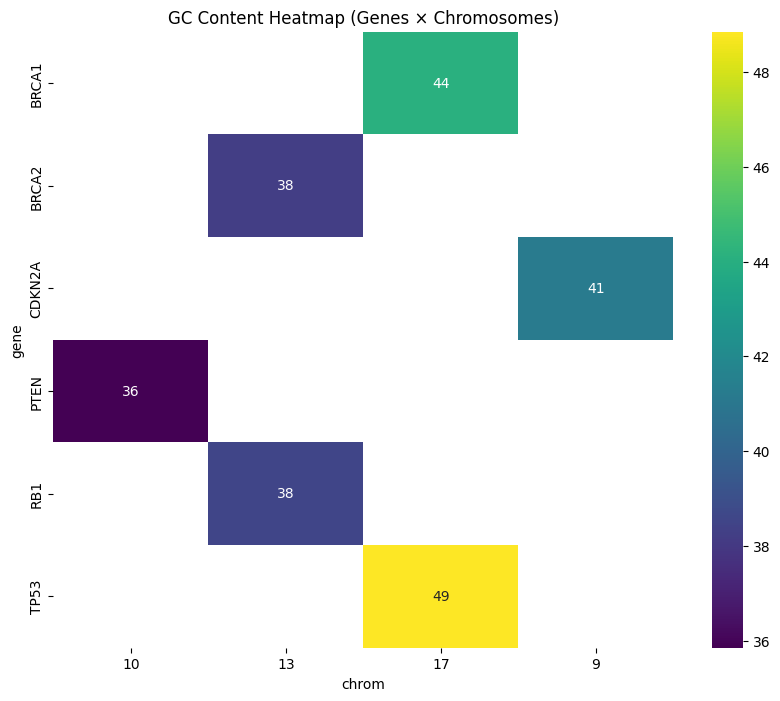

 # DNA Sequence analysis for the Tumor supressor genes 

 ## Problem statement 
Analyzing large volumes of biological data, especially in oncogenomics, presents significant challenges that strain the development and impementation of personalized medicine. There are specific genes like oncogens that has potential to cause cancer, and genes named tumor supressors that plays a critical role in regulating cell growth and preventing cancer. These genes often harbor complex mutations that vary widely between idividulas, making it difficult to identify which genetic changes are clinicaly relevant.The sheer size and complexity of genomic datasets, often involving millions of base pairs and thousands of variants require advanced computational tools to process, interpret, and visualize the data efficiently.

Bioinformatics enables researchers the analysis and interpretation of complex genetic data, identification of mutations, prediction of their impact, and integration of diverse data types such as genomic, transcriptomic, and proteomic data. By using computationaly analyzed data, clinicians can match genetic profiles to targeted therapies, predict treatment responses, and design personalized treatment plans based on a patient’s unique molecular signature. This ultumately transforms the raw genomic data into actionable insights, bridging the gap between complex biology and individualized cancer care.

## Project  Goal 

The primary objective of this project is to  build a modular DNA sequence analysis pipeline that focuses on biologically significant regions of the human genome such as genes, promoters, enhancers, coding sequences (CDS), and exons—rather than entire chromosomes, which span millions of base pairs. Specifically, the pipeline targets **tumor suppressor genes**, which are essential for regulating cell cycle progression, DNA repair, and apoptosis, but are frequently mutated in human cancers. By extracting genomic sequences from these targeted regions on canonical chromosomes, the pipeline enables precise computation of GC content, identification of open reading frames (ORFs), transcription of DNA to RNA, and translation of RNA to proteins. This focused approach supports accurate annotation, mutation profiling, and biological interpretation of genomic data, laying a foundation for scalable and reproducible analysis in bioinformatics and cancer genomics research.

## Importance of Tumor Supressor genes 
Tumor supressors are the gatekeepers of the key cell functionalities such as : 
- cell cyclce progression ( Gene TP53 act as a cell cycle checkpoint and halts the cell division, if DNA is damaged).
- DNA repair(Genes like BRCA1 or BRCA2 fix double strand breaks in the structure of the DNA and repairs).
- Apoptosis( Gene TP53 activates the death signal when the cell damage is irreplacable programmed cell death).

Loss-of-function mutations in tumor suppressor genes disrupt their ability to regulate cell growth, repair DNA damage, and trigger apoptosis. As a result, cells may proliferate uncontrollably, accumulate genetic errors, and evade programmed cell death; hallmarks of cancer development. These critical roles make tumor suppressor genes highly valuable as clinically actionable targets for cancer prognosis, risk assessment, and therapeutic decision-making.

Tumor supressors fragments or pseudogenes may appear in  non-canonical ochromosomes as well, due to duplication or assembly artifacts. For reproducable analysis only canonical chromosomes are considered  and the follwowings are the major tumor supressors analyzed in this project.

- TP53 (Chromosome 17)
- RB1 (Chromosome 13)
- BRCA1 (Chromosome 17)
- BRCA2 (Chromosome 13)
- CDKN2A( Chromosome 9)
- PTEN (Chromosome 10)

## Data
  The data for this project is obtained from the Ensembl FASTA file, which is a text-based biological data file provided by the [Ensembl Genome Database](https://useast.ensembl.org/info/data/ftp/index.html) Project. It contains nucleotide (DNA/RNA) or protein sequences for a particular organism in FASTA format. In order to analyze the  DNA sequences of the Human genome, Human reference genome of assembly version **GRCh38** is used.

  The human reference genome is an assembled mosaic of fromo multiple individuals that serves as a baseline for comparison in genetics. It represents the most common DNA sequence found across many people.It includes all 22 autosomes, the X and Y sex chromosomes, and the mitochondrial DNA (MT). It also contains 261 alternate loci representing complex regions like MHC and LRC/KIR, around 169 unplaced scaffolds not assigned to specific chromosomes, and centromere sequences, making it a more complete human genome reference.

## Exploratory Data Analysis 

Based on the initial analysis performed on the GRCh38 primary assembly, it shows the human genome contains  many unplaced genomic scaffolds and some chromosomes contain undetermined nucleotides which were represented by "N" in the sequence. Unplaced scaffolds are a DNA sequence which is part of the genome, but has not been confidently assigned to a specific location on any chromosome. These exist because some regions in the genome are hard to assemble due to repetitive sequences, structural complpexity and low sequence coverage. If analyzing novel gene discovery or strucural variations, these scaffolds are worth exploring.

The project focuses on analyzing tumor suppressor genes located on canonical chromosomes to ensure reliable and interpretable results. So that, unplaced genomic scaffolds are excluded due to challenges in genome assembly and uncertain chromosomal mapping.

## Extracting Tumor Supressor Genes of canonical Chromosomes 
In order to extract the location co-ordinates of a specific genes located in any particular part of the chromosome, the GTF annotation file was used. **"Homo_sapiens.GRCH38.110.gtf"** is use for genome annotation where each row describes a genomic feature of the chromosome such as gene, exons or coding sequence(CDS). Each row represented a chromosome of the human genome, it has columns named `chr`,`source`,`feature_type`,`start`,`end`,`score`,`strand`,`frame`,`attributes`. The `atrributes` columns contained important metadata such as the name of the genomic fearure and its ID. 

FASTA file contained the actual DNA sequence of each chromosome and raw sequence data. AFter extracting the location co-ordinates of the specific gene, the DNA sequence of the FASTA file is sliced based on those cordinates to extract the filtered DNA sequence of the specific gene. If the DNA strand is negative ("-"), it should be reverese complemented when extracting, because  obtaining the coding DNA strand in its primary direction 5'-> 3' is critical in gene analysis. 

The extracted sequences of the tumor supressor genes of the canonical chromosomes were saved and written to a seperate FASTA file named  **"tumor_suppressors.fa"**, which would make it easier to use in downstream analysis. 

## GC content Calculation 
GC content refers to the proportion of guanine (G) and cytosine (C) bases in DNA, which influences both biological and technical aspects of the DNA. High GC regions provide greater thermal stability due to stronger hydrogen bonding, play a key role in gene regulation through promoters and CpG islands, and affect mutation rates and DNA repair. However, they can also complicate sequencing and PCR amplification. 

GC-rich regions in tumor suppressor genes are biologically significant because they are prone to methylation at CpG sites, which can silence gene expression—a common mechanism in cancer. Aberrant methylation of GC-rich promoters can lead to gene silencing and contribute to tumorigenesis. Additionally, understanding GC content aids in designing targeted therapies and diagnostic tools such as PCR primers and probes. It also supports comparative genomics by enabling the analysis of tumor suppressor genes across species or between normal and cancerous tissue.

### Visualization of the GC content across each gene

The following plot shows the use of a sliding window of fixed length(500) across the  DNA sequence of each gene to identify the local GC variation; the GC rich and poor regions on the gene.

   *Image1: The sliding window plots showing the local GC variation across genes*

GC content patterns vary across tumor suppressor genes, reflecting differences in structure and function. **CDKN2A** and **RB1** show strong GC% fluctuations, indicating regulatory regions or intron–exon transitions, while **PTEN** and **BRCA2** maintain steadier GC levels typical of stable coding regions. **BRCA1** exhibits moderate GC% with occasional peaks which could corresponds to functional exons, and **TP53** shows balanced GC content, consistent with its conserved role in genome protection. These patterns provide insights into gene regulation, stability, and potential functional elements.

The GC content heatmap below  plots the GC content for each gene across their chromosome shows the comparative GC levels amoong tumor supressor genes and chromosome-Specific Patterns, highlighting whether certain chromosomes tend to have GC-rich regions for these genes.

   *Image2: GC content distribution ( genes x Chromosomes)*

The GC heatmap shows the GC content for each gene on its respective chromosome, reflecting the sequence composition of those genes. **TP53** on chromosome 17 has the highest GC content at **49%**, while **PTEN** on chromosome 10 is lower at **36%**. CDKN2A on chromosome 9 is moderately high at 41%, BRCA1 on chromosome 17 has 44%, and BRCA2 on chromosome 13 is at 38%. This variation highlights differences in sequence composition and potential functional or structural characteristics among these tumor suppressor genes.

## ORF(Open Reading Frame) Detection

ORF detection identifies protein-coding regions in DNA by locating stretches that start with a start codon (ATG) and end with a stop codon (TAA, TAG, TGA), maintaining the same reading frame without interruptions. These regions contain codons (triplets of bases) that encode amino acids. Reading frames determine how nucleotides are grouped into codons, and only one frame produces the correct functional protein. ORF detection is crucial because tumor suppressor genes and oncogenes often have mutations that disrupt ORFs or create alternative ones, leading to nonfunctional or harmful proteins. Detecting ORFs helps pinpoint frameshift mutations, identify alternative protein isoforms, annotate new protein coding regions, and distinguish functional genes from pseudogenes. Overall, ORF analysis is essential for understanding mutations in cancer-related genes and designing targeted therapies to restore lost function.

DNA can have 6 possible biologically relevant ORFS, three on the forward strand and other three on the reverse complement strand( which are not read by riboseomes in the transaltion). The results shows each tumor supressor genes got more than hundreds of computational ORFs, because it typically identify any stretch of codons without a stop codon, not just the biologically relevant coding sequence. It may includes Small ORFs (sORFs) within introns or UTRs and non-coding regions that happen to lack stop codons for a while.

